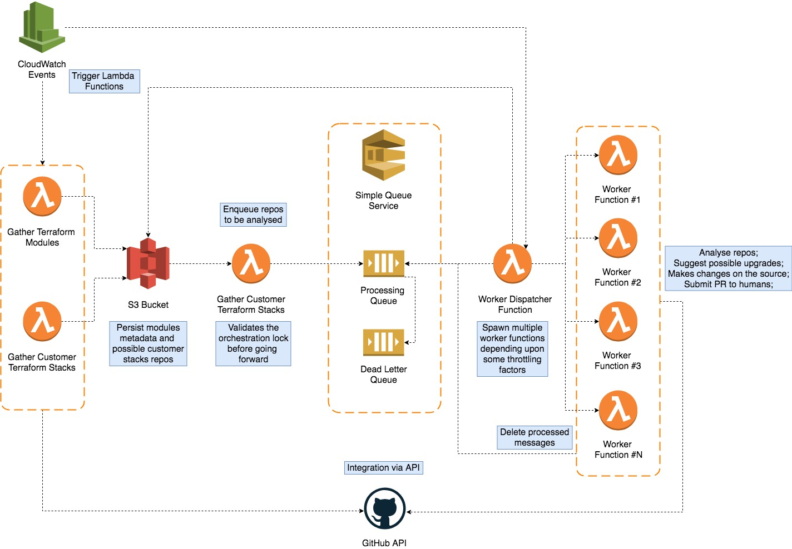

# Terraform-Dependency-Monitoring

## What's it?
It's an intelligent Dependency Monitoring for Terraform that automatically upgrades your dependencies through friendly GitHub pull requests.

## architecture

## License
