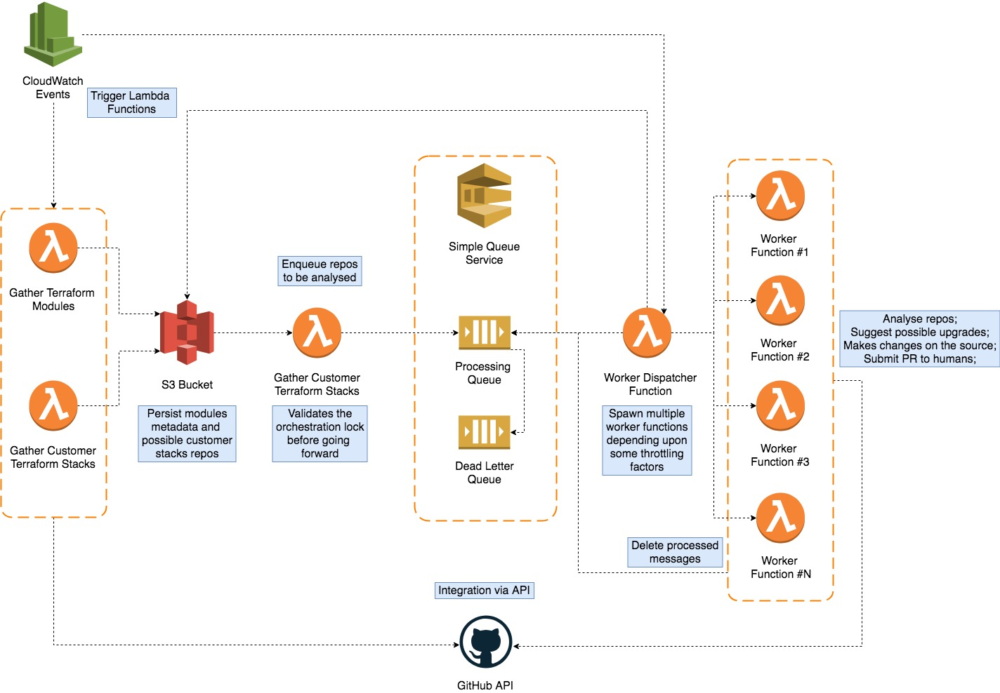

# Soltius-Terraform-Dependency-Monitoring

## What's it?
It's an intelligent Dependency Monitoring for Terraform that automatically upgrades your dependencies through friendly GitHub pull requests.

## architecture

## What do I need to start receiving PRs suggesting upgrades to my project's depedency?
Nothing at all! It automatically works for all Terraform customer stack repos within our organisation out-of-the-box.
